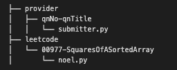

# File Structure

-------------------------
# Contributing

## Submissions

### Your first submission

Please do a pr, i will add merge permission once i know your github handle :)

### Subsequent submissions

Auto-merge will do. 

### Suggestion on how to collaborate

If you have prepared solutions before hand and would like peer review, create a [pr](#pull-requests) and assign your reviewing peer.

### Pull Requests

while yeetcoders will be granted permission to push, using PRs and github features can help us keep track on collaboration matters. its foc too!

Create PR for solutions and tag label solution:

#### Example

Title: Problem Name

Label: solution

-------------------------

# Notes

Its a community based repo with no hard and fast rules (just don't delete anything from our combined effort~), please be civic-minded while you contribute :] Have fun yeetcoding~~ 

Merge working solns only and inline-comment on analysis is optional. As a mental exercise, read other's solutions and analyze if need be.